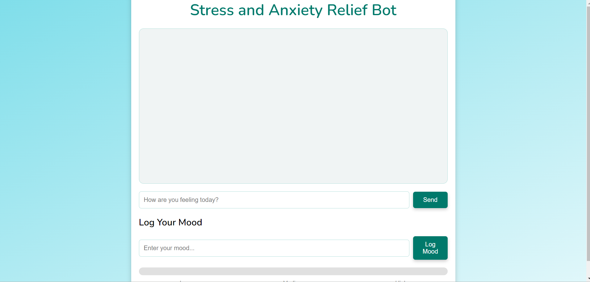
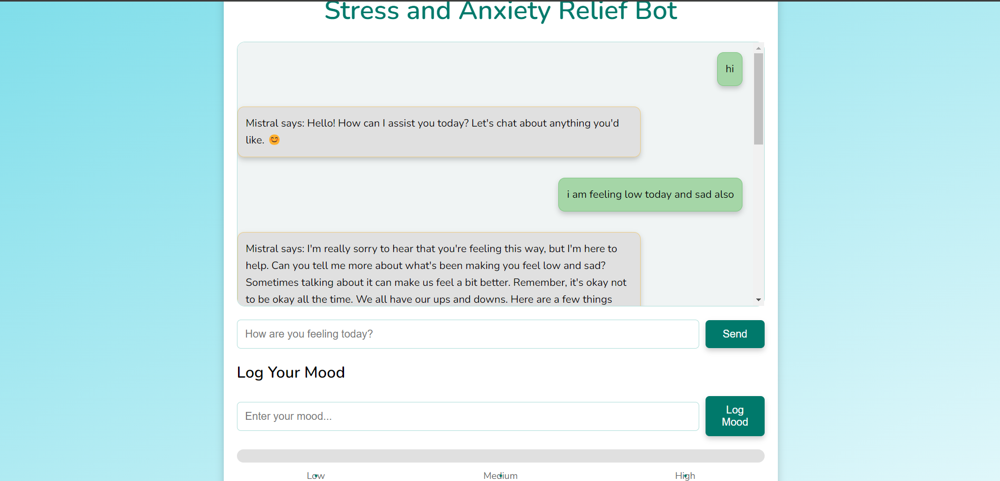
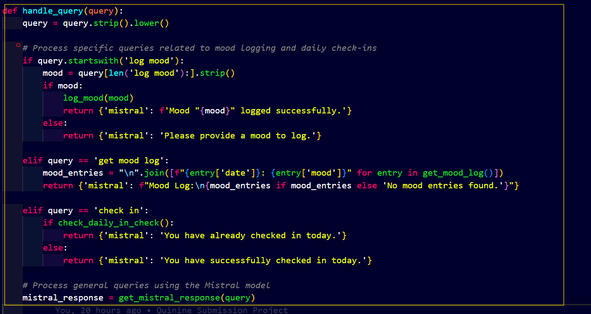
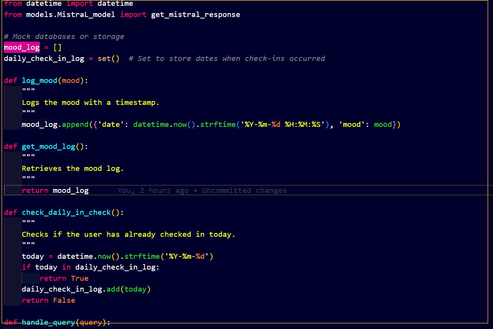

# Relax Rover


## Problem statement:


[link to Quest](https://quira.sh/quests/creator/submissions?questId=16)

```

Main track:

If you want your submission to be eligible for a prize, your app must use at least one of the following APIs

ChatGPT
Mistral
Llama
Anthropic

🧢 A sticker sheet will be sent to the creators of the first 100 valid submissions. Also, a "Quira Creator" hat will be sent to the 5 creators that... we'll keep this rule secret until the end of the Quest!

To claim a prize, make sure you follow the rules!

The content you submit to the quest must be original.
You are allowed to generate code with LLMs and to use StackOverflow, but the app/repo idea must be yours and yours only. If we detect plagiarism from other repo or user, your submission will be marked and you won't be eligible for a prize.
Your project must have a README and must clearly explain what the project does and how someone can run it or install it.
Team submissions are not supported in this quest.
You can only submit one repo. If you make a mistake, you have to remove the repo and upload a new one.
You can submit repositories used in a previous quest, provided they implement a new feature. The new feature should be described in the comments.

```
## Overview:

## **Stress and Anxiety Relif Bot** :

RelaxRover is a chatbot designed to provide stress and anxiety relief through conversational interactions. It utilizes the latest Mistral model and natural language processing (NLP) models to offer supportive and calming responses to users seeking help.


## Table of Contents

- [Features](#features)
- [Installation](#installation)
- [Usage](#usage)
- [API Reference](#api-reference)
- [Contributing](#contributing)
- [License](#license)
- [Contact](#contact)


# Folder Structure:

```
project_root/
│
├── frontend/
│   ├── index.html
│   ├── static/
│       ├── css/
│       │   └── styles.css
│       └── js/
│           └── script.js
│
├── backend/
|   |   models/
|   |   chatgpt_model.py
|   |   llama_model.py
│   ├── app.py
│   └── bot_logic.py
│
└── venv/ (virtual environment)
|___   .env


```

## Working Video and images of Web app:


https://github.com/user-attachments/assets/5341dd16-e591-4120-b1d7-0cddd056a56c


## Images:






## Custom code function and bot logic added by me for mood:








## Features

- **Conversational Support:** Engage in conversations focused on stress relief and mental well-being.
- **AI-Powered Responses:** Leverage advanced NLP models for insightful and empathetic replies.
- **User-Friendly Interface:** A simple web interface for easy interaction with the bot.
- **Log Your Mood:** You can also log your mood. it will displayed as an level of feelings you are having on the anxiety bar 


## Installation

### Prerequisites

- Python 3.8+
- Pip (Python package manager)
- A valid Mistral API Key 

### Setup

1. **Clone the repository:**

   ```bash
   git clone https://github.com/Blacksujit/RelaxRover_Anxiety_Relif_Bot
   ```

2. **Create a virtual environment and activate it:**


```
python -m venv venv
```

```
source venv/bin/activate  # On Windows use `venv\Scripts\activate`
```

3. **Install the required packages:**

```
pip install -r requirements.txt

```

4. **Set up environment variables:**

`Create a .env  file in the root directory and add your mistral API and other api key:`
 
`MISTRAL_API_KEY` = 'your_mistral_ai_api_key'

`LOGIN_KEY` = 'your_login_token_from_hugging_face'


5. **Start the Flask server:**

```
python backend/app.py

```

# **API Reference**:

> get this credentials from specific platforms.

Open_ai_api_key = https://platform.openai.com/settings/profile?tab=api-keys

login_key_from_hugging_face = https://huggingface.co/settings/tokens

Mistral_api_Key = https://chat.mistral.ai/chat/f49eac86-1d65-4adb-8d8e-c242941c5d9b


# **Contributing**:

Contributions are welcome! Please fork the repository and submit a pull request with your improvements or fixes. For major changes, please open an issue to discuss your ideas first.

Fork the repository.

Create a `.env ` file in the root directory and add your mistral API and other api key:

1.) Create a new branch `(git checkout -b feature-branch).`

2.) Commit your changes `(git commit -am 'Add new feature').`

3.) Push to the branch` (git push origin feature-branch).`

4.) Create a new Pull Request.


# **License**:
This project is licensed under the MIT License.  

# **Contact**:

For any inquiries or issues, please reach out to:

Author: Sujit Nirmal

Email: nirmalsujit981@gmail.com

GitHub: @blacksujit
